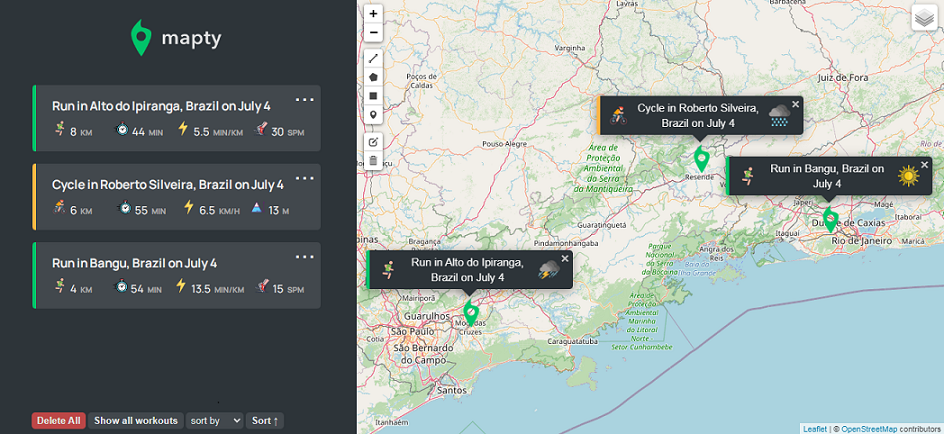

# About
Aplicativo web feito durante o curso [The Complete JavaScript Course](https://www.udemy.com/course/the-complete-javascript-course/) com algumas 
funcionalidades novas implementadas por mim

A aplicação consiste em mapear exercícios através de um mapa interativo

## Overview

### Screenshot

### Links

- Live site: (https://alan589.github.io/mapty/)

## My process

### Built with

- JavaScript
- HTML
- CSS
- [Leaflet](https://leafletjs.com/) - JS library

### Working on the following features :hammer_and_wrench:  
- [x] Ability to edit a workout  
- [x] Ability to delete a workout  
- [x] Ability to delete all workouts   
- [x] Ability to sort workouts by a certain field (e.g. distance) 
- [x] Re-build Running and Cycling objects coming from Local Storage 
- [ ]	More realistic error and confirmation messages 
- [ ]	Ability to position the map to show all workouts 
- [x] Ability to draw lines and shapes instead of just points  
- [ ]	Geocode location from coordinates ("Run in Faro, Portugal") 
- [ ]	Display weather data for workout time and place  

### Useful Resources
- [Leaflet](https://leafletjs.com/) - an open-source JavaScript library for mobile-friendly interactive maps
- [Leaflet Draw](https://leaflet.github.io/Leaflet.draw/docs/leaflet-draw-latest.html) - Leaflet's plugin, helped me to drawing geometric shapes on the map

## Author

- Linkedin - [Alan cavalcante](https://www.linkedin.com/in/alan-cavalcante-382051206/)

